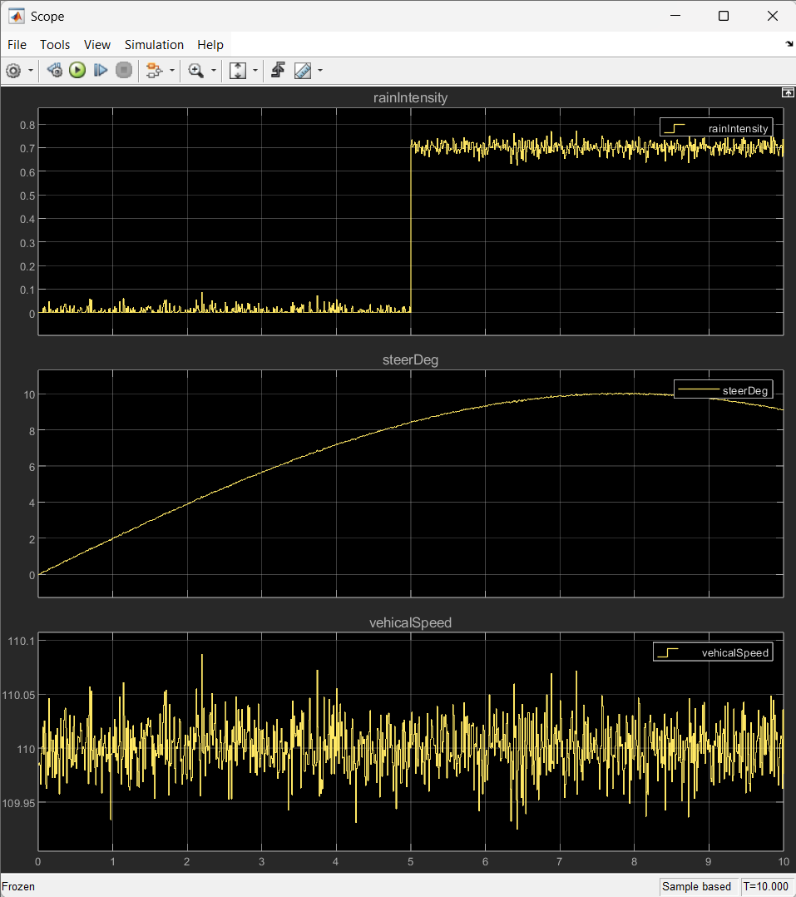
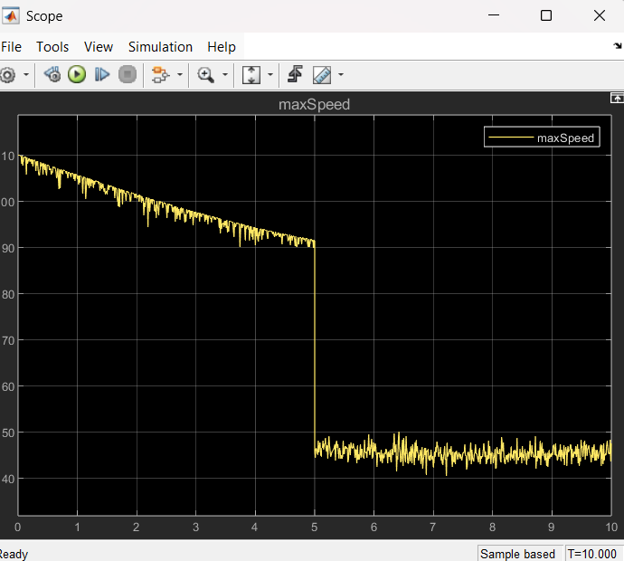
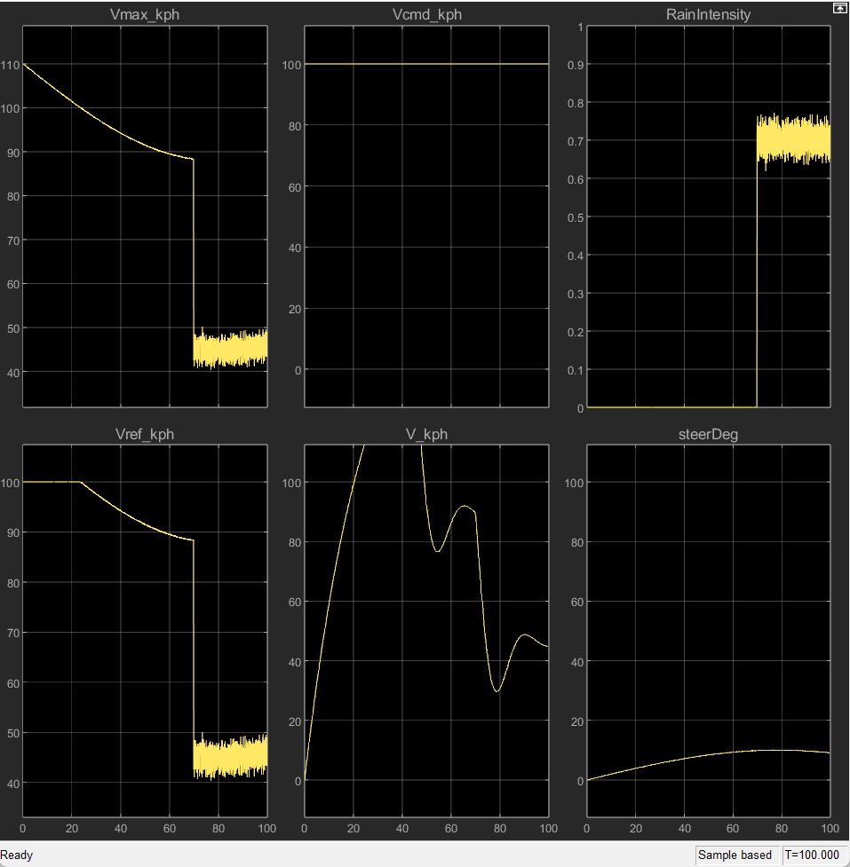
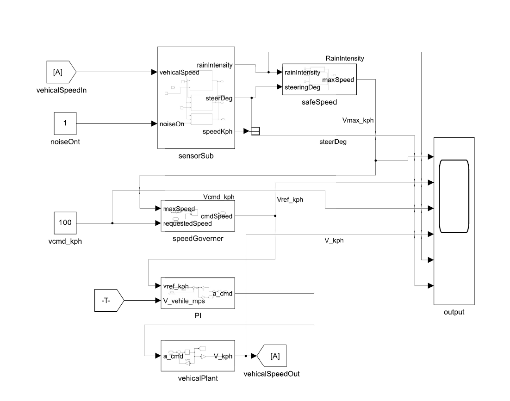

# Vehicle Safety Control – Simulink Model

## Overview
This project implements a vehicle safety control system in Simulink.  
It models environmental effects (rain), vehicle dynamics (wheel speed), and applies safety strategies (speed limits and governors) to ensure safe operation under varying conditions.

---

## System Architecture
The complete system integrates four main subsystems:

### 1. Sensor Hub
Simulates rain, wheel speed, and steering inputs.  

### 2. Safety Manager
Adjusts the safe maximum speed (`Vmax_kph`) based on rain intensity.  

### 3. Speed Governor
Ensures the commanded reference speed never exceeds the safe limit.  

### 4. PI Controller
Regulates actual speed (`V_kph`) to follow the reference speed (`Vref_kph`).  
Currently showing overshoot (further tuning required).  

[View Model](Model_Snaps/PI_Controller.pdf)
---

## Complete Model
Overall system block diagram:  

---

## Current Status
- Sensor subsystem implemented and tested  
- Safety manager working with adaptive speed adjustment  
- Speed governor integrated and functional  
- PI controller implemented but requires tuning (overshooting observed)  
- Next step: add actuator dynamics and refine controller

---

## Repository Contents
- `Model_Snaps/` → Subsystem diagrams and complete model  
- `scope_outputs/` → Simulation results (scope captures)  
- `Vehical_Safety_control.slx` → Main Simulink model

MATLAB Version
Tested in MATLAB R2024
